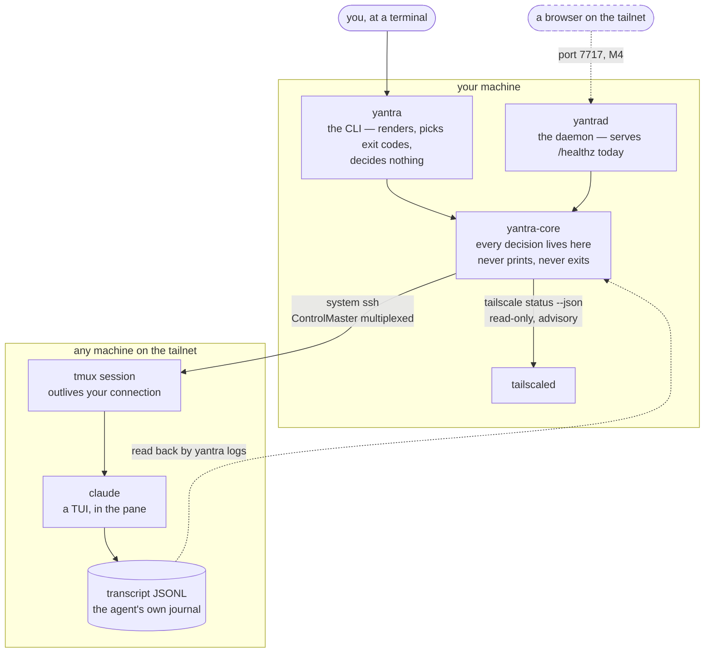
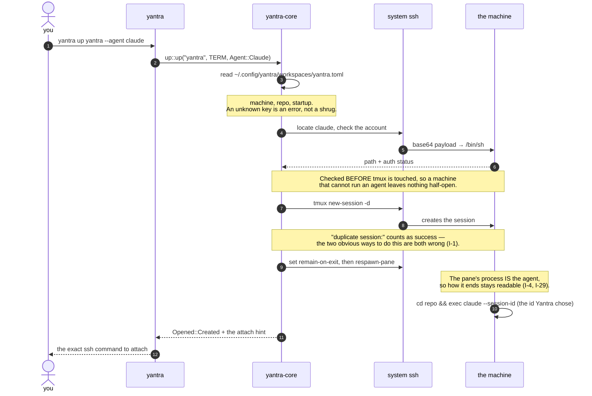
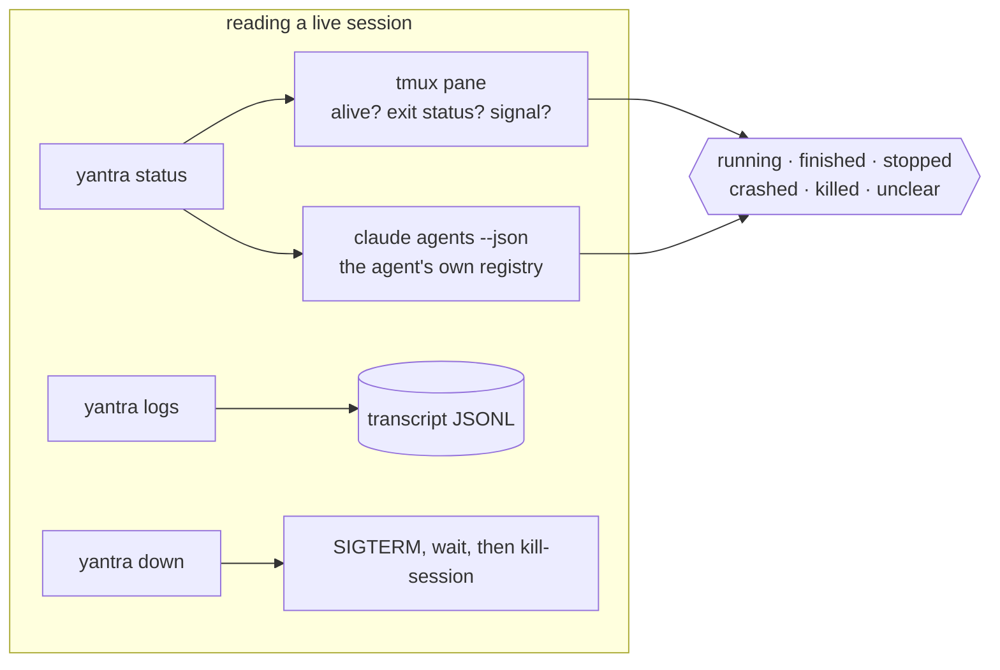
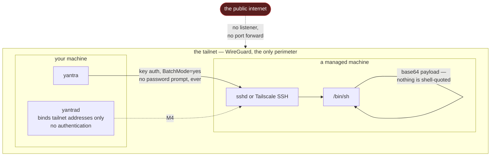
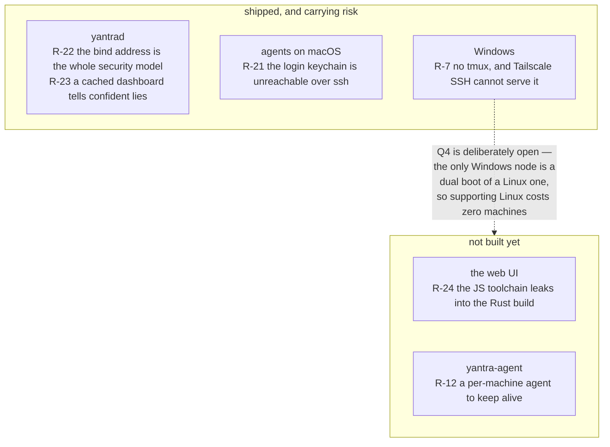
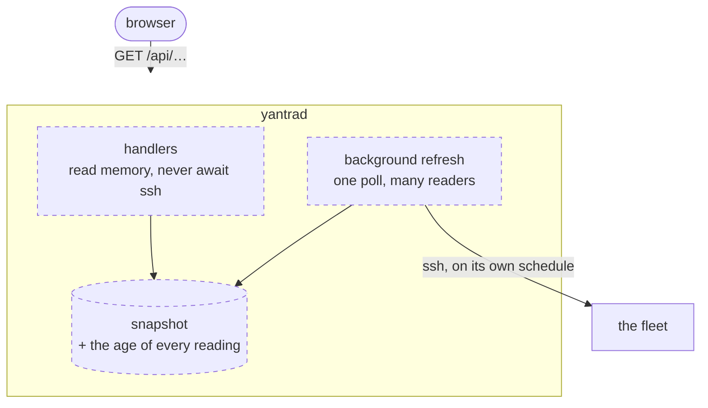

# Architecture

What Yantra is, how a command actually reaches a machine, what protects what, and where it is going.

Diagrams are Mermaid, which GitHub renders inline — no build step, no generated assets, nothing to
regenerate when the code changes. If a diagram disagrees with the code, the code is right and the
diagram is a bug.

**Status labels below mean what they say.** Solid lines exist and are tested. Dashed lines are
planned and not built. This file is not a proposal — the proposals live in
[`docs/plans/`](plans/).

---

## 1. The shape today

Yantra orchestrates programs that already work. It does not reimplement a terminal multiplexer, an
SSH client, or a VPN — that constraint is §B2 of [`CLAUDE.md`](../CLAUDE.md) and it is the single
biggest reason the codebase is small.

**Four crates, and only one of them thinks.**

| Crate | Job | State |
| --- | --- | --- |
| [`yantra-core`](../crates/yantra-core/README.md) | All orchestration: ssh, tmux, agents, inventory, workspaces. Never prints, never exits ([ADR-0005](adr/0005-core-logic-in-a-library-crate.md)). | **Nearly all the code** |
| [`yantra`](../crates/yantra/README.md) | The CLI. Layout, wording, exit codes. | Working, four milestones deep |
| [`yantrad`](../crates/yantrad/README.md) | The daemon. An HTTP surface over the same library. | Serves a health check |
| [`yantra-agent`](../crates/yantra-agent/README.md) | Per-machine heartbeat, so the scheduler can see a sleeping laptop. | Skeleton |

The CLI and the daemon are **two callers of one library**, not a stack —
[ADR-0012](adr/0012-the-cli-and-the-daemon-are-two-callers-of-one-library.md). `yantra` keeps working
on a machine where `yantrad` was never started.

---

## 2. What actually happens on `yantra up`

The interesting parts are the ones that are not obvious: the agent's account is checked **before**
tmux is touched, and the command crosses the wire base64-encoded so nothing needs quoting.

Running it again attaches instead of duplicating. Idempotency is designed in, not bolted on (§B4).

Afterwards, three commands read that session without ever sending it a keystroke:

`status` reads **two independent sources and reports their disagreement rather than resolving it**.
Where they contradict each other the answer is `unclear` *with its reason attached* — never a guess.
That design earned itself immediately: a signal-killed pane leaves the exit status **empty**, so
anything defaulting it to zero reports a `kill -9` as a clean finish (I-47).

---

## 3. Security, and what is actually protecting what

The honest version, including the parts that are policy rather than code.

### What each layer does

| Boundary | Mechanism | Verified |
| --- | --- | --- |
| Nothing is publicly reachable | `yantrad` binds only the addresses Tailscale reports for **this** machine, and **refuses to start** if it cannot learn them | ✅ `ss -ltnp` shows the tailnet addresses and no `0.0.0.0`; `curl 127.0.0.1:7717` is refused |
| No auth on the daemon | Deliberate. Q6 settled that Yantra is personal-first, so the bind address **is** the security model (R-22) | ⚠️ a design decision, not a control — see below |
| Remote command injection | Every command crosses as **base64 decoded by `/bin/sh` on the far side**, so a hostile `repo` path stays an argument. POSIX quoting was tested and breaks on an embedded newline (I-26) | ✅ tested against a real `/bin/sh`, with a hostile path |
| Host identity | `UserKnownHostsFile` in Yantra's own state dir, `StrictHostKeyChecking=accept-new` | ✅ |
| Credentials on disk | Yantra stores **none**. It never asks for a password: `BatchMode=yes` means a machine that wants one fails instead of prompting | ✅ |
| Agent account tokens | Yantra never reads them. `claude auth status` prints an email, an org id and a subscription type; the struct that parses it **names only two fields**, so the rest cannot reach a log line | ✅ a deliberate privacy boundary |
| Secrets in workspaces | **Policy, not yet code.** The schema has no secrets field at all. When it gains one it holds a *reference* (`op://…`, `pass show …`, a sops path) resolved at launch and never written to disk, logs, the API or a terminal stream | ⬜ not implemented — Q5 |

### The two things to understand before trusting this

**`yantrad` has no authentication, on purpose.** Anyone who can reach your tailnet on port 7717 can
read everything it exposes — machine names, workspace names, repo paths. That is an accepted
consequence of Q6 (personal-first), and it is why the bind address is treated as a security control
rather than a convenience: there is **no `--bind` flag and no `--port` flag**, because a flag that can
expose the API is a flag someone eventually passes. If you share a tailnet with people you would not
give a shell to, do not run the daemon yet.

**A workspace file is a code-execution path.** `machine` and `repo` come from a file on disk and end
up in a remote shell. They are quoted as such, with tests that assert the exact string *and* prove the
behaviour on a real shell — but treat `~/.config/yantra/workspaces/` with the same care as `~/.ssh/`.

---

## 4. Where the live risks sit

Every risk in [`tracker.md`](../tracker.md) §7 attaches to a component. Retired ones are omitted.

**R-7 (Windows) is the top risk and is not being worked on.** That is a choice, recorded rather than
forgotten: the tailnet's only Windows node is the second boot of a machine that already runs Linux,
so supporting Linux alone costs zero machines. Note that a green Windows build proves nothing here —
what compiles for Windows is `yantra-agent`, still a stub. Windows' actual problem is having no tmux.

**R-21 (macOS agents cannot authenticate over ssh)** is real and unfixed. It costs a target rather
than the project, because reaching a Linux machine *through* the Mac sidesteps it entirely — one
`ProxyJump` line in `~/.ssh/config`, and no Yantra code at all. The Mac itself now has an accepted
decision — [ADR-0018](adr/0018-the-tmux-server-carries-the-macos-login-session.md), which keeps ssh
as the only transport and gives `yantra-agent` no new job — and nothing built on it yet: the risk
retires when Y-151 ships the ADR's §1 and §5 and M7 installs its §7 launchd job.

---

## 5. Where this is going

```mermaid
flowchart LR
    M1["M1 · walking skeleton"] --> M2["M2 · real machines"] --> M3["M3 · agents"] --> M4["M4 · web UI"] --> M5["M5 · placement"] --> M6["M6 · browser terminal"] --> M7["M7 · appliance"] --> M8["M8 · hardware panel"]

    classDef done fill:#1e4620,stroke:#3fb950,color:#fff
    classDef doing fill:#3d2e00,stroke:#d29922,color:#fff
    class M1,M2,M3 done
    class M4 doing
```

**M4 is two milestones wearing one name.** `yantrad` has to serve `yantra-core` over HTTP before a
web UI has anything to read. The plan is [`docs/plans/m4-web-ui.md`](plans/m4-web-ui.md).

**Why the daemon cannot be a thin passthrough**, which is the single design constraint of M4: `ssh`
is configured with `ConnectTimeout=10`, so a machine that is asleep or holding an expired node key
costs **ten seconds**. That is fine for a CLI — a human typed the command and is watching. It is not
fine for a page that polls whether or not anyone is looking, where one open tab becomes a permanent
ssh storm against the whole fleet.

It pays for itself twice: `ControlPersist=300` means any refresh under five minutes keeps every ssh
master warm (**20 ms** against **150 ms** cold), and because the socket path is per-user, a running
daemon makes the **CLI** faster too.

Beyond M4 the destination is [`docs/vision.md`](vision.md): ask for a workspace, and the right
machine wakes, the repo opens, tmux restores and the agent resumes — from a phone, a browser, or a
knob on a box on the desk.

---

## Read next

- [`README.md`](../README.md) — install and usage
- [`tracker.md`](../tracker.md) — what is decided, open, and at risk, right now
- [`crates/*/tracker.md`](../crates/) — **the invariants**, filed with the crate each one binds. The
  highest-value thing in the repo: 46 rules, most of them earned by a bug that presented as
  something else entirely
- [`docs/adr/`](adr/) — the decisions, immutable once accepted
